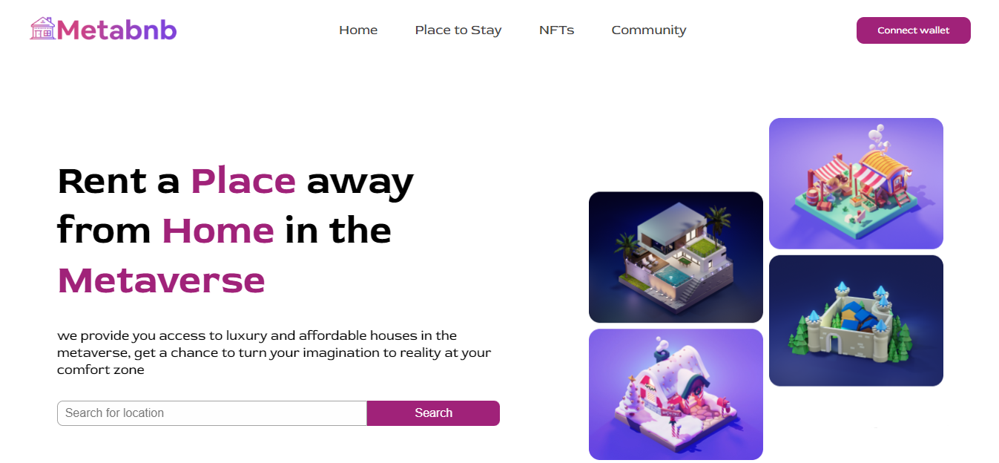

# Meta BnB | Zuri Internship Task 3

## Site address
[Meta BnB](https://roni-meta-bnb.vercel.app/)

## Site Preview


## To run the code locally

```
git clone https://www.github.com/ronniiii-i/meta-bnb.git
cd meta-bnb
npm install 
npm start
```

This runs the app in the development mode.\
Open [http://localhost:3000](http://localhost:3000) to view it in your browser.


## Author

👤 **Princess Roni Egbu**

* Twitter: [@ronniiii_i](https://twitter.com/ronniiii_i)
